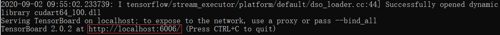

# Tensorflow 学习笔记（十）TensorBoard

* 本笔记将介绍 TensorBoard 可视化工具，并介绍如何在 Keras 和自定义模型中保存 TensorBoard 所需要的参数。
* 本笔记实验代码的输出结果详见 Tensorflow2.0-in-action 仓库：9 TensorBoard 记事本文件。


## TensorBoard 介绍

* Tensorboard 是深度学习中很好的**可视化训练过程**和**模型结构**的工具。

### 启动

* 这里仅介绍 cmd 下的启动方法，jupyter notebook 与 pycharm 下的启动自行查找。
* 首先需要将训练数据文件保存在一个文件夹中，需要注意这个文件夹的路径中尽量不包含中文。
* 比如这里将数据存储在 E:\tf20\keras_log 文件中，那么接下来只要打开命令行输入（请注意一定要在合适的虚拟环境下）：

```python
tensorboard --logdir E:\tf20\keras_log
```

* 等待打开会出现一个网址：



* 在 Chrome 浏览器中打开即可。


### 界面解释

* SCALARS：显示了如何将 loss、accuracy 随每个时间段的改变。还可以使用它来跟踪训练速度，学习率和其他标量值。
* GRAPHS：进行可视化模型。在这种情况下，将显示层的 Keras 图，这可以帮助确保模型正确构建。
* DISTRIBUTIONS 和 HISTOGRAMS：显示张量随时间的分布。这对于可视化权重与偏差并验证他们是否以预期的方式变化很有用。

* 下面是四个界面的示例显示图：


### 训练方式

* 由于 Tensorflow 2.0 中，训练一个神经网络模型主要有两种方式：
  * 使用 tf.keras 模块的 Model.fit()；
  * 使用 tf.GradientTape 求解梯度，从而自定义训练过程。 
* 下面我们主要用两个实例来分别说明。


## Keras 训练中使用 TensorBoard

* 在 Keras 模型中训练使用 TensorBoard 的方法相对简单，其主要思路是利用回调函数，在回调函数中内置 TensorBoard 函数。

```python
tf.keras.callbacks.TensorBoard(
    log_dir='logs',
    histogram_freq=0,
    write_graph=True,
    write_images=False,
    update_freq='epoch',
    profile_batch=2,
    embeddings_freq=0,
    embeddings_metadata=None
)
```


### 参数含义

* **log_dir**：保存 TensorBoard 要解析的日志文件的目录的路径。(windows 下尽量不要保存两层目录)
* **histogram_freq**：频率（在 epoch 中），计算模型层的激活和权重直方图。如果设置为 0，则不会计算直方图。必须为直方图可视化指定验证数据（或拆分）。
* **write_graph**：是否在 TensorBoard 中可视化图像。当 write_graph 设置为 True 时，日志文件可能会变得非常大。
* **write_images**：是否在 TensorBoard 中编写模型权重以显示为图像。
* **update_freq**："batch" 或 "epoch" 为整数。使用 "batch" 时，在每个 batch 后将损失和指标（评估函数）写入 TensorBoard。这同样适用于 "epoch"。如果使用整数，如 1000，回调将在每 1000 个样本后将指标或损失写入 TensorBoard。但过于频繁地写入 TensorBoard 会降低训练速度。
* **profile_batch**：分析批次以采样计算特征。profile_batch 必须是非负整数或正整数对的逗号分隔字符串。一对正整数表示要分析的批次范围。默认情况下，它将配置第二批。将 profile_batch = 0 设置为禁用性能分析。必须在 TensorFlow eager 模式下运行。
* **embeddings_freq**：可视化嵌入层的频率（以 epoch 为单位）。如果设置为 0，则嵌入将不可见。
* **embeddings_metadata**：字典，将层名称映射到文件名，该嵌入式的元数据保存在该文件名中。


### Experiment 1：在 Keras 训练中使用 TensorBoard

* 由于在 Keras 训练中使用相对简单，直接展示代码：

#### 导入数据，构建模型

```python
mnist = np.load("../../Dataset/mnist.npz")
x_train, y_train, x_test, y_test = mnist['x_train'], mnist['y_train'], mnist['x_test'], mnist['y_test']
x_train, x_test = x_train / 255.0, x_test / 255.0

# Add a channels dimension
x_train = x_train[..., tf.newaxis]
x_test = x_test[..., tf.newaxis]
```

```python
class MyModel(Model):
    def __init__(self):
        super(MyModel, self).__init__()
        self.conv1 = Conv2D(32, 3, activation='relu')
        self.flatten = Flatten()
        self.d1 = Dense(128, activation='relu')
        self.d2 = Dense(10, activation='softmax')
    @tf.function
    def call(self, x):
        x = self.conv1(x)
        x = self.flatten(x)
        x = self.d1(x)
        return self.d2(x)
```

#### 使用 TensorBoard 回调函数

```python
model = MyModel()
model.compile(optimizer='adam',
              loss='sparse_categorical_crossentropy',
              metrics=['accuracy'])

tensorboard_callback = tf.keras.callbacks.TensorBoard(log_dir="E:/Dataset/tensorboard_for_keras", 
                                                      histogram_freq=1,
                                                      profile_batch = 100000000)

model.fit(x=x_train, 
          y=y_train, 
          epochs=20, 
          validation_data=(x_test, y_test), 
          callbacks=[tensorboard_callback])
```

#### 可能能在 jupyter 内打开 TensorBoard 的代码

```python
%load_ext tensorboard

%tensorboard --logdir=E:/Dataset/tensorboard_for_keras
```


## 自定义训练中使用 TensorBoard

* 在自定义训练中使用 TensorBoard 的方法相对复杂，这里先将关键步骤做简单介绍，再给出完整实例。


### 创建 summary writer 实例

* tf.summary.create_file_writer：
  * logdir：文件夹路径；
  * max_queue：最多在缓存中暂存 max_queue 个数据，当超过时，flush 更新到日志文件中并清空缓存。默认为10 。
  * flush_millis：至少 flush_millis 毫秒内进行一次 flush。默认为 120,000 毫秒。
  * filename_suffix：日志文件的后缀。默认为.v2。
  * name：（tf1.0 的残余特性，可忽略）本操作的名称。

```python
tf.summary.create_file_writer(
    logdir, max_queue=None, flush_millis=None, filename_suffix=None, name=None
)
```

#### 图片

* 保存形状为 [k, h, w, c] 的 Tensor。tf.summary.image：

```python
tf.summary.image(
    name, data, step=None, max_outputs=3
)
```

#### 生成折线图

* 保存单个数值。tf.summary.scalar：

```python
tf.summary.scalar(
    name, data, step=None, description=None
)
```

#### 文本

* 保存一个 tf.string 类型的 Tensor。tf.summary.text：

```python
tf.summary.text(
    name, data, step=None, description=None
)
```

#### 直方图或密度图

* 保存一个张量。tf.summary.histogram：

```python
tf.summary.histogram(
    name, data, step=None, buckets=None, description=None
)
```

#### 音频

* 保存形状为 [k, t, c] 的 Tensor。tf.summary.audio：

```python
tf.summary.audio(
    name, data, sample_rate, step=None, max_outputs=3, encoding=None, description=None
)
```


### 查看 Graph 和 Profile 信息，跟踪信息

* tf.summary.trace_export()：停止 trace，将之前的 trace 记录到的信息写入 profiler 日志文件。
* tf.summary.trace_off()：停止 trace，并舍弃之前的 trace 记录。
* tf.summary.trace_on()：开始 trace，并记录计算图和分析信息。


### Experiment 2：在自定义模型训练中使用 TensorBoard

#### 构建模型

* 在 Experiment 1 的基础上构建：

```python
train_ds = tf.data.Dataset.from_tensor_slices(
    (x_train, y_train)).shuffle(10000).batch(32)
test_ds = tf.data.Dataset.from_tensor_slices((x_test, y_test)).batch(32)
```

```python
class MyModel(Model):
    def __init__(self,**kwargs):
        super(MyModel, self).__init__(**kwargs)
        self.conv1 = Conv2D(32, 3, activation='relu')
        self.flatten = Flatten()
        self.d1 = Dense(128, activation='relu')
        self.d2 = Dense(10, activation='softmax')
        
    @tf.function # 注意这里实现了静态图
    def call(self, x):
        x = self.conv1(x)
        x = self.flatten(x)
        x = self.d1(x)
        return self.d2(x)
```

#### 训练步骤

```python
loss_object = tf.keras.losses.SparseCategoricalCrossentropy()

optimizer = tf.keras.optimizers.Adam()

train_loss = tf.keras.metrics.Mean(name='train_loss')
train_accuracy = tf.keras.metrics.SparseCategoricalAccuracy(name='train_accuracy')

test_loss = tf.keras.metrics.Mean(name='test_loss')
test_accuracy = tf.keras.metrics.SparseCategoricalAccuracy(name='test_accuracy')

def train_step(images, labels):
    with tf.GradientTape() as tape:
        predictions = model(images)
        loss = loss_object(labels, predictions)
    gradients = tape.gradient(loss, model.trainable_variables)
    optimizer.apply_gradients(zip(gradients, model.trainable_variables))

    train_loss(loss)
    train_accuracy(labels, predictions)
```

#### 训练并保存成 TensorBoard

```python
model = MyModel()

stamp = datetime.datetime.now().strftime("%Y%m%d-%H%M%S")
import os
logdir = os.path.join("logs/"+stamp)

summary_writer = tf.summary.create_file_writer(logdir) 

EPOCHS = 1

for epoch in range(EPOCHS):
    for (x_train, y_train) in train_ds:
        train_step(x_train, y_train)
                    
    with summary_writer.as_default():                               # 希望使用的记录器
        tf.summary.scalar('loss', train_loss.result(), step=epoch)
        tf.summary.scalar('accuracy', train_accuracy.result(), step=epoch)  # 还可以添加其他自定义的变量

    # Reset metrics every epoch
    train_loss.reset_states()
    test_loss.reset_states()
    train_accuracy.reset_states()
    test_accuracy.reset_states()
    
with summary_writer.as_default():
    tf.summary.trace_on(graph=True, profiler=False)  # 开启Trace，可以记录图结构和profile信息
    tf.summary.trace_export(name="model_trace", step=3, profiler_outdir=None)    # 保存Trace信息到文件
```


* Written by：Sirius. Lu
* Reference：深度之眼《Tensorflow 框架训练营》
* 2020.9.3