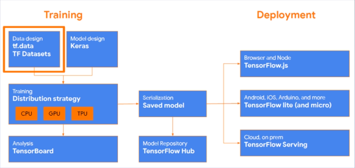

# Tensorflow 学习笔记（一）Tensorflow 简介

* 本笔记简要介绍了 Tensorflow 2.0 的历史、特性以及基本安装步骤。


## Tensorflow 2.0 简介

### 历史

* 2015 年：
  * 2015.11 Tensorflow 宣布开源并首次发布
  * 2015.12 支持 GPUs，Python 3.3（v 0.6）
* 2016 年：
  * 2016.4 分布式 Tensorflow（v 0.8）
  * 2016.11 支持 Windows（v 0.11）
* 2017 年：
  * 2017.2 性能改进，API 稳定性（v 1.0）
  * 2017.4 Keras 集成（v 1.1）
  * 2017.8 高级 API，预算估算器，更多模型，初始 TPU 支持（v 1.3）
  * 2017.11 Eager execution 和 Tensorflow Lite（v 1.5）
* 2018 年：
  * 2018.3 推出 TF hub，Tensorflow.js，Tensorflow Extended（TFX）
  * 2018.5 新入门内容：Cloud TPU 模块与管道（v 1.6）
  * 2018.6 Tensorflow Probability（v 1.8）
  * 2018.8 Cloud Big Table 集成（v 1.10）
  * 2018.10 侧重于可用性的 API 改进（v 1.12）
* 2019 年：Tensorflow 2.0 发布


### 为什么学习 Tensorflow？

#### Tensorflow 的特点

* 开源生态成熟
* 完整的部署流程
* 产品化方案



#### Tensorflow 1.x 有哪些问题？

* 文档和接口混乱
* 默认占用所有 GPU 的所有内存
* 使用繁琐
* 调试困难

#### Tensorflow 2.x vs 1.x

* **Functions, not sessions**：
  * 小例子：

```python
# TF1
a = tf.constant(5)
b = tf.constant(3)
c = a * b

with tf.Session() as sess:
    print(sess.run(c))
```

```python
# TF2
a = tf.constant(5)
b = tf.constant(3)
c = a * b

print(c)
```

* Tensorflow 1.x 和 2.x 的区别：
  * session.run() -> Eager execution
  * 全局化 -> 不再全局化
  * sessions -> Functions
  * API 混乱 -> API 清理

#### Tensorflow 2.0 的变化

* Tensorflow 2.0 删除了冗余 API ，使 API 更加一致（统一 RNN，统一优化器），并通过 Eager Execution 运行时更好地与 Python 集成。
* Tensorflow 2.0 推荐使用 tf.keras，tf.data 等高层库：
  * 用 Eager 模式搭建模型；
  * 用 tf.data 处理数据；
  * 用 tf.feature_column 提取特征；
  * 用 tf.keras 搭建模型；
  * 用 tf.saved_model 打包模型。


### Eager Execution

#### 类比

* eager 模式就是类似于 python 的**命令式编程**，写好程序之后，不需要编译，就直接运行，而且非常直观。
* Session 静态图模式则类似于 C/C++ 的**声明式编程**，写好程序之后要先编译，然后才能运行。

#### Tensorflow 改进

* eager 模式是在 TF 1.4 版本之后引入的，在 TF 2.x 的版本，会把 eager 模式变为默认执行模式。
* 好处：
  * 不需要编写完整的静态图；
  * 调试不需要打开会话（Session）；
  * Python 上调用它进行计算可以直接得出结果。
* 这也意味着 Tensorflow 2.x 的入门要简单得多！

#### 优缺点

* 优点：
  * eager 模式提供了更直观的接口，可以像写 python 代码一样写模型；
  * 更方便调试；
  * 自然的控制流程，像编写 python 程序一样。
* 缺点：
  * 通过 **graph** 构造的模型在分布式训练、性能优化以及线上部署上有优势。

* Tensorflow 2.x 如何用 graph 构造呢？
  * 推荐使用 @tf.function（而非 1.x 中的 tf.Session）实现 Graph Execution，
  * 从而将模型转换为易于部署且高性能的 Tensorflow 图模型。

#### 例子

```python
@tf.function # 转换图模型
def simple_nn_layer(x, y):
    return tf.nn.relu(tf.matmul(x, y))

x = tf.random.uniform((3, 3))
y = tf.random.uniform((3, 3))

simple_nn_layer(x, y)
```


### Tensorflow 2.0 API 层次结构

#### 综述

* TensorFlow API 一共可以分为三个层次：即低阶 API，中阶 API，高阶 API。
* 第一层为 Python 实现的**操作符**，主要包括各种**张量操作算子**、**计算图**、**自动微分**。
* 第二层为 Python 实现的**模型组件**，对低级 API 进行了函数封装，主要包括各种**模型层**，**损失函数**，**优化器**，**数据管道**，**特征列**等等。
* 第三次为 Python 实现的模型成品，一般为按照 OOP 方式封装的高级 API，主要为 **tf.keras.models 提供的模型的类接口**。

#### 低层 API

* 下面给出低层的一些函数：

```python
# 重要函数
tf.* # 低层
tf.dtypes # 数据类型转化
tf.math # 数学标量运算
tf.initializers # 初始化操作
tf.random # 随机数生成
tf.linalg # 线性代数的运算
tf.strings # 字符串处理
tf.ragged # 张量操作，如切片

# 其他函数
tf.audio # 声音处理
tf.image # 图像处理
tf.io # 文件处理
```

* 例子：

```python
import tensorflow as tf
a = tf.constant([[1, 2], [3, 4]])
b = tf.constant([[5, 6], [7, 8]])

# 标量计算：
tf.math.add(a, b) # 加法 a + b
tf.math.subtract(a, b) # 减法 a - b
tf.math.multiply(a, b) # 乘法 a * b
tf.math.divide(a, b) # 除法 a / b

# 向量运算
a = tf.range(1, 100)
tf.print(tf.reduce_sum(a))
tf.print(tf.reduce_mean(a))
tf.print(tf.reduce_max(a))
tf.print(tf.reduce_min(a))
tf.print(tf.reduce_prod(a))
```

#### 中层 API

* 下面给出中层的一些函数：

```python
tf.data # 数据管道
tf.feature_column # 特征列
tf.nn # 激活函数
tf.keras.layers # 模型层，如CNN、RNN
tf.keras.losses # 损失函数
tf.keras.metrics # 评估函数
tf.keras.optimizers # 优化器
tf.keras.callbacks # 回调函数
tf.summary # 模型可视化
```

* 例子：

```python
a = tf.random.uniform(shape=(10,5), minval=0, maxval=10)
tf.nn.softmax(a)

a = tf.random.uniform(shape=(10,5), minval=-0.5, maxval=-0.5)
b = tf.keras.layers.Dense(10)(a)
b = tf.nn.softmax(b)

a = tf.random.uniform(shape=(10,100,50), minval=-0.5, maxval=-0.5)
a = tf.keras.layers.LSTM(100)(a)
b = tf.keras.layers.Dense(10)(a)
b = tf.nn.softmax(b)
```

#### 高层 API

* 高层 API 主要包括：tensorflow.keras.models
  * 建模方式有三种：
    * Sequential 方法
    * 函数式 API 方法
    * Model 子类化自定义模型
* 如何建模在后文介绍。
* 例子：

```python
import tensorflow as tf

X = tf.random.uniform(shape=(10,100,50), minval=-0.5, maxval=-0.5)
y = tf.random.categorical(tf.random.uniform(shape=(10,3), minval=-0.5, maxval=-0.5), 2)

model = tf.keras.models.Sequential()
model.add(tf.keras.layers.LSTM(100, input_shape=(100,50)))
model.add(tf.keras.layers.Dense(10))
model.add(tf.keras.layers.Dense(2, activation='softmax'))

model.compile(optimizer='adam', loss='categorical_crossentropy', metrics=['accuracy'])
model.summary()
model.fit(X, y)
```

#### 总结

* 在本节最后，我们回到最初给出的 TensorFlow 框架图：


* Training（训练）部分：首先导入数据（利用 tf.data 数据管道），模型设计采用 Keras 建模；接着用 CPU 或 GPU 训练，接着根据 TensorBoard 提供的一些指标来分析。
* 模型经过保存后可以进入 TF Hub 来保留参数和复用参数。
* Deployment 模型部署：支持 js、IOS、Tensorflow Serving 等方式。


## Tensorflow 2.0 安装

* tf2.0 的安装不太复杂，和其他 tf 版本差不多，因此这里只介绍 win10 下基本安装步骤和代码实现：


### Tensorflow cpu 安装

* 首先换用清华源：

```shell
# 临时换用
pip install -i https://pypi.tuna.tsinghua.edu.cn/simple some-package
# 永久更改
pip install pip -U
pip config set global.index-url https://pypi.tuna.tsinghua.edu.cn/simple
```

* 直接使用 cpu 跑程序可以直接在命令行输入下面的代码：

```python
pip install tensorflow==2.0.0
```


### Tensorflow-gpu 安装

#### 安装驱动

* nvidia 驱动的安装有很多种，可以直接在 nvidia 内安装，上官网自动更新，或手动更新，或使用驱动精灵等软件更新即可。
* 更新后，用 nvidia-smi 看一下版本。如果没有该命令，检查一下系统变量 Path 中有没有添加：

```
C:\Program Files\NVIDIA Corporation\NVSMI
```

#### 安装 CUDA

* 下载 CUDA，笔者使用的版本是：cuda_10.0.130_411.31_win10；
* CUDA 下载后需要需要安装，安装时只勾选 CUDA 相应包，并去掉 CUDAVisualStudioIntegration。
* 安装后，向用户变量 path 中写入：

```
C:\Program Files\NVIDIA GPU Computing Toolkit\CUDA\v10.0\bin
C:\Program Files\NVIDIA GPU Computing Toolkit\CUDA\v10.0\extras\CUPTI\libx64
```

#### 安装 cudnn

* cudnn 是一个神经网络加速包，笔者使用的版本是：cudnn-10.0-windows10-x64-v7.6.0.64；
* 注意：在官网上下载的时候需要注册一个 nvidia 账号。
* 将 cudnn 上的文件复制到 CUDA 安装目录下，替换原文件即可。

#### 安装 tensorflow-gpu

* 可以提前检验一下 CUDA 是否安装成功：

```shell
nvcc -V
```

* 以上语句查看版本号。
* 如果无误，下面直接安装 gpu 环境：

```shell
pip install tensorflow-gpu==2.0.0
```

* 等待安装完成。

#### 测试

* 用下面的 python 代码可以测试 tensorflow-gpu 是否可用：

```python
import tensorflow as tf
print(tf.__version__) # 2.0.0  检查tensorflow版本号
print(tf.test.is_gpu_available()) # True  检查gpu是否可用（第一次检查可能会很慢，需耐心等待！）
```

* 以上就是 Tensorflow 安装的全部工作了。


* Written by：Sirius. Lu
* Reference：深度之眼《Tensorflow 框架训练营》
* 2020.8.20